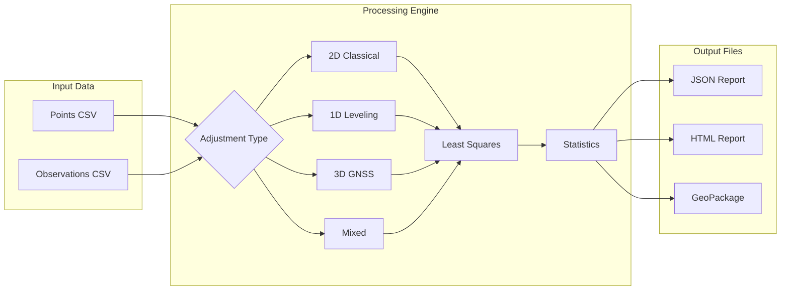

<p align="center">
  
</p>

<h1 align="center">Survey Adjustment & Network Analysis</h1>

<p align="center">
  <strong>Production-ready least-squares adjustment plugin for QGIS</strong>
</p>

<p align="center">
  <a href="https://qgis.org/"></a>
  <a href="LICENSE"></a>
  <a href="https://github.com/Osman-Geomatics93/survey_adjustment/releases"></a>
</p>

<p align="center">
  <a href="https://github.com/Osman-Geomatics93/survey_adjustment/stargazers"></a>
  <a href="https://github.com/Osman-Geomatics93/survey_adjustment/network/members"></a>
  <a href="https://github.com/Osman-Geomatics93/survey_adjustment/issues"></a>
  <a href="https://github.com/Osman-Geomatics93/survey_adjustment/commits/master"></a>
</p>

<p align="center">
  <a href="#features">Features</a> •
  <a href="#video-tutorials">Tutorials</a> •
  <a href="#sample-data--examples">Examples</a> •
  <a href="#installation">Installation</a> •
  <a href="#faq">FAQ</a> •
  <a href="#roadmap">Roadmap</a>
</p>

---

## Overview

A comprehensive **least-squares adjustment** engine for professional surveying workflows inside QGIS. This plugin transforms QGIS into a powerful geodetic computation platform, supporting everything from simple leveling runs to complex mixed GNSS/classical networks.

### Workflow Diagram



---

## Why This Plugin?

| Feature | This Plugin | Commercial Software | Manual Excel |
|:--------|:-----------:|:-------------------:|:------------:|
| **Cost** | Free & Open Source | $500 - $5000+ | Free |
| **QGIS Integration** | Native | No | No |
| **2D Network Adjustment** | Yes | Yes | Limited |
| **1D Leveling** | Yes | Yes | Yes |
| **3D GNSS with Covariance** | Full 3×3 | Varies | No |
| **Mixed Observations** | Yes | Some | No |
| **Robust Estimation** | 3 Methods | Varies | No |
| **Reliability Analysis** | MDB + External | Some | No |
| **Reproducible Reports** | JSON + HTML | Proprietary | Manual |
| **Customizable** | Open Source | No | Yes |
| **No Dependencies** | NumPy only | Various | N/A |

---

## Features

### Adjustment Types

| Type | Description | Observations |
|:-----|:------------|:-------------|
| **2D Classical** | Traditional traverse & network adjustment | Distances, directions, angles |
| **1D Leveling** | Precise height determination | Height differences |
| **3D GNSS** | Baseline vector adjustment | Full 3×3 covariance support |
| **Mixed** | Unified multi-technique solution | All observation types combined |

### Advanced Capabilities

- **Robust Estimation (IRLS)** — Huber, Danish, IGG-III weight functions for automatic outlier handling
- **Constraint Health Analysis** — Clear diagnostics with actionable error messages
- **Auto-Datum** — Automatic minimal constraint application with full audit trail
- **Statistical Testing** — Chi-square global test, standardized residuals, redundancy analysis
- **Reliability Analysis** — MDB (Minimal Detectable Bias) and external reliability metrics
- **Error Ellipses** — Confidence ellipses with configurable probability level

### Output Formats

| Format | Description |
|:-------|:------------|
| **JSON Report** | Machine-readable results for pipelines and automation |
| **HTML Report** | Publication-ready report with statistics and visualizations |
| **GeoPackage** | Spatial layers: adjusted points, error ellipses, residual vectors |

---

## Video Tutorials

Learn how to use every feature of the plugin with these comprehensive video guides:

### Complete Plugin Tutorial
> **Full walkthrough of all plugin features and workflows**

[](https://drive.google.com/file/d/1yjOBM-kpYZ6LB9uowH4fpO04oKj1tjH3/view?usp=sharing)

### Algorithm-Specific Tutorials

| Algorithm | Description | Video Link |
|:----------|:------------|:-----------|
| **Adjust Leveling (1D)** | Height difference adjustment with benchmarks | [](https://drive.google.com/file/d/1sLe45rJhrYYpp8DASJ-lYSWszHqzlgDm/view?usp=sharing) |
| **Adjust Network (2D)** | Classical traverse and network adjustment | [](https://drive.google.com/file/d/1N9_t8FQtLPAAnLLZiUSlpwdZr4dW0zyi/view?usp=sharing) |
| **Adjust Network (3D GNSS)** | GNSS baseline vector adjustment | [](https://drive.google.com/file/d/1VOEii6IZvkwYTJ2lhaaT_6GqXhuGgHA8/view?usp=sharing) |
| **Adjust Network (Mixed)** | Combined classical + GNSS + leveling | [](https://drive.google.com/file/d/1kH2ZBakFIvABrYZLGPI3Q5YUouHIkIeZ/view?usp=sharing) |

---

## Sample Data & Examples

Get started immediately with ready-to-use test datasets. All examples include input CSV files and expected results.

### Download Sample Data

| Dataset | Description | Contents | Link |
|:--------|:------------|:---------|:-----|
| **1D Leveling** | Benchmark network with 6 points | Points + 12 height differences | [View](examples/1d_leveling/) |
| **2D Traverse** | Classical traverse with 5 stations | Points + distances + directions + angles | [View](examples/2d_traverse/) |
| **2D Trilateration** | Distance-only network | Points + distances | [View](examples/2d_trilateration/) |
| **3D GNSS** | GNSS baseline network with 6 points | Points + 13 baselines with covariance | [View](examples/3d_gnss/) |
| **Mixed Network** | Combined multi-technique survey | Classical + GNSS + leveling | [View](examples/mixed_network/) |

> **Tip:** Download the entire [`examples/`](examples/) folder to try all datasets.

---

## Example Outputs

See what results look like from each adjustment type:

### 1D Leveling Adjustment Result

```
Leveling Adjustment Report
━━━━━━━━━━━━━━━━━━━━━━━━━━━━━━━━━━━━━━━━━━━━━━━━━━━━━━━━━━━━━━━━━━━━━━━━━━
Status: ✓ Success | Converged | Iterations: 1 | DOF: 8 | σ₀² = 0.0113

Constraint Health Summary
┌──────────────────┬────────┬─────────────────────────────────────────┐
│ Category         │ Status │ Details                                 │
├──────────────────┼────────┼─────────────────────────────────────────┤
│ Height Datum     │ ✓ OK   │ Fixed heights: [BM_A, BM_B]             │
│ Connectivity     │ ✓ OK   │ All points connected                    │
│ Degrees of Freedom│ ✓ OK  │ Redundant: DOF = 8 (12 obs, 4 unknowns) │
└──────────────────┴────────┴─────────────────────────────────────────┘

Adjusted Points
┌────────┬───────────┬───────────┬───────┐
│ ID     │ H (m)     │ σH (m)    │ Fixed │
├────────┼───────────┼───────────┼───────┤
│ BM_A   │ 100.0000  │ 0.0000    │ Yes   │
│ BM_B   │ 102.5000  │ 0.0000    │ Yes   │
│ TP1    │ 100.8501  │ 0.0001    │ No    │
│ TP2    │ 101.4199  │ 0.0001    │ No    │
│ TP3    │ 101.9800  │ 0.0001    │ No    │
│ TP4    │ 102.1498  │ 0.0001    │ No    │
└────────┴───────────┴───────────┴───────┘
```

### 2D Network Adjustment Result

```
Survey Adjustment Report
━━━━━━━━━━━━━━━━━━━━━━━━━━━━━━━━━━━━━━━━━━━━━━━━━━━━━━━━━━━━━━━━━━━━━━━━━━
Status: ✓ Success | Converged | Iterations: 2 | DOF: 13 | σ₀² = 0.193

Constraint Health Summary
┌──────────────────┬────────┬─────────────────────────────────────────┐
│ Category         │ Status │ Details                                 │
├──────────────────┼────────┼─────────────────────────────────────────┤
│ Horizontal Datum │ ✓ OK   │ Fixed E: [CP1, CP2], Fixed N: [CP1, CP2]│
│ Orientation      │ ✓ OK   │ 4 direction set(s), rotation constrained│
│ Connectivity     │ ✓ OK   │ All points connected                    │
│ Degrees of Freedom│ ✓ OK  │ Redundant: DOF = 13 (23 obs, 10 unknowns)│
└──────────────────┴────────┴─────────────────────────────────────────┘

Adjusted Points
┌────────┬────────────┬────────────┬────────┬────────┐
│ ID     │ E          │ N          │ σE     │ σN     │
├────────┼────────────┼────────────┼────────┼────────┤
│ CP1    │ 1000.0000  │ 2000.0000  │ 0.0000 │ 0.0000 │
│ CP2    │ 1500.0000  │ 2000.0000  │ 0.0000 │ 0.0000 │
│ T1     │ 1100.0028  │ 2150.0026  │ 0.0014 │ 0.0014 │
│ T2     │ 1250.0020  │ 2250.0014  │ 0.0018 │ 0.0013 │
│ T3     │ 1400.0037  │ 2150.0001  │ 0.0015 │ 0.0013 │
└────────┴────────────┴────────────┴────────┴────────┘

Error Ellipses (95% Confidence)
┌────────┬──────────┬──────────┬──────────┐
│ Point  │ a (m)    │ b (m)    │ θ (deg)  │
├────────┼──────────┼──────────┼──────────┤
│ T1     │ 0.0043   │ 0.0025   │ 226.37   │
│ T2     │ 0.0045   │ 0.0031   │ 259.35   │
│ T3     │ 0.0041   │ 0.0027   │ 307.28   │
└────────┴──────────┴──────────┴──────────┘
```

### 3D GNSS Baseline Adjustment Result

```
GNSS Baseline Adjustment Report
━━━━━━━━━━━━━━━━━━━━━━━━━━━━━━━━━━━━━━━━━━━━━━━━━━━━━━━━━━━━━━━━━━━━━━━━━━
Status: ✓ Success | Converged | Iterations: 1 | DOF: 27 | σ₀² = 0.006

Adjusted Points
┌────────┬──────────────┬──────────────┬──────────┬────────┬────────┬────────┐
│ ID     │ E            │ N            │ H        │ σE     │ σN     │ σH     │
├────────┼──────────────┼──────────────┼──────────┼────────┼────────┼────────┤
│ BASE   │ 500000.0000  │ 4500000.0000 │ 150.0000 │ 0.0000 │ 0.0000 │ 0.0000 │
│ GPS1   │ 500150.0024  │ 4500200.0022 │ 155.2032 │ 0.0002 │ 0.0002 │ 0.0005 │
│ GPS2   │ 500350.0012  │ 4500249.9986 │ 148.8018 │ 0.0002 │ 0.0002 │ 0.0005 │
│ GPS3   │ 500249.9987  │ 4500400.0028 │ 162.1042 │ 0.0002 │ 0.0002 │ 0.0005 │
│ GPS4   │ 500400.0010  │ 4500149.9972 │ 145.5031 │ 0.0002 │ 0.0002 │ 0.0006 │
│ REF2   │ 500500.0000  │ 4500000.0000 │ 152.5000 │ 0.0000 │ 0.0000 │ 0.0000 │
└────────┴──────────────┴──────────────┴──────────┴────────┴────────┴────────┘

Baseline Residuals
┌────────┬────────┬────────┬─────────────┬──────────┬───────┬───────┐
│ ID     │ From   │ To     │ Length (m)  │ |v| (mm) │ w_max │ Flag  │
├────────┼────────┼────────┼─────────────┼──────────┼───────┼───────┤
│ BL001  │ BASE   │ GPS1   │ 250.057     │ 0.57     │ 1.700 │       │
│ BL002  │ BASE   │ GPS2   │ 430.118     │ 0.40     │ 0.485 │       │
│ BL011  │ GPS1   │ GPS3   │ 223.711     │ 0.77     │ 2.678 │ ⚑     │
└────────┴────────┴────────┴─────────────┴──────────┴───────┴───────┘
```

### Mixed Adjustment Result (Classical + GNSS + Leveling)

```
Mixed Adjustment Report
━━━━━━━━━━━━━━━━━━━━━━━━━━━━━━━━━━━━━━━━━━━━━━━━━━━━━━━━━━━━━━━━━━━━━━━━━━
Status: ✓ Success | Converged | Iterations: 3 | DOF: 25 | σ₀² = 0.155

Observation Mix: 16 classical + 6 GNSS baselines + 7 leveling

Adjusted Points
┌────────┬────────────┬────────────┬──────────┬────────┬────────┬────────┐
│ ID     │ E          │ N          │ H        │ σE     │ σN     │ σH     │
├────────┼────────────┼────────────┼──────────┼────────┼────────┼────────┤
│ BM01   │ 10200.0000 │ 20000.0000 │ 502.5000 │ 0.0000 │ 0.0000 │ 0.0000 │
│ CORS   │ 10000.0000 │ 20000.0000 │ 500.0000 │ 0.0000 │ 0.0000 │ 0.0000 │
│ TS01   │ 10100.0001 │ 20099.9986 │ 501.8005 │ 0.0010 │ 0.0010 │ 0.0004 │
│ TS02   │ 10150.0009 │ 20200.0013 │ 503.2008 │ 0.0010 │ 0.0011 │ 0.0006 │
│ TS03   │ 10249.9987 │ 20150.0002 │ 502.1002 │ 0.0010 │ 0.0009 │ 0.0005 │
│ TS04   │ 10300.0018 │ 20249.9998 │ 504.5007 │ 0.0010 │ 0.0010 │ 0.0006 │
└────────┴────────────┴────────────┴──────────┴────────┴────────┴────────┘

Residuals Summary (flagged observations)
┌────────┬──────────┬────────┬────────┬──────────┬───────┬───────┐
│ ID     │ Type     │ From   │ To     │ v (mm)   │ w     │ Flag  │
├────────┼──────────┼────────┼────────┼──────────┼───────┼───────┤
│ D003   │ distance │ TS03   │ TS04   │ 3.62     │ 2.904 │ ⚑     │
│ D005   │ distance │ TS02   │ TS04   │ -5.25    │ -3.271│ ⚑     │
└────────┴──────────┴────────┴────────┴──────────┴───────┴───────┘
```

> View complete HTML reports in the [`examples/`](examples/) folder for full details including all residuals, reliability metrics, and error ellipses.

---

## Installation

### Method 1: QGIS Plugin Manager (Recommended)
```
1. Open QGIS
2. Navigate to: Plugins → Manage and Install Plugins
3. Search for "Survey Adjustment"
4. Click "Install Plugin"
```

### Method 2: Install from ZIP
```
1. Download the latest release from GitHub Releases
2. In QGIS: Plugins → Manage and Install Plugins → Install from ZIP
3. Select the downloaded ZIP file
4. Click "Install Plugin"
```

### Requirements
- **QGIS 3.22** or later
- **NumPy** (included with QGIS)
- No additional dependencies required (statistics implemented without SciPy)

---

## Quick Start

### One-Click Install

Copy and run in QGIS Python Console to install:

```python
# Install from QGIS Plugin Repository
import pyplugin_installer
pyplugin_installer.instance().fetchAvailablePlugins(False)
pyplugin_installer.instance().installPlugin('survey_adjustment')
```

Or download manually:

```bash
# Clone repository
git clone https://github.com/Osman-Geomatics93/survey_adjustment.git

# Copy to QGIS plugins folder (Windows)
xcopy /E /I survey_adjustment "%APPDATA%\QGIS\QGIS3\profiles\default\python\plugins\survey_adjustment"

# Copy to QGIS plugins folder (Linux/Mac)
cp -r survey_adjustment ~/.local/share/QGIS/QGIS3/profiles/default/python/plugins/
```

### Quick Example (2D Network)

**1. Create `points.csv`:**
```csv
point_id,easting,northing,fixed_easting,fixed_northing
A,1000.000,2000.000,true,true
B,1000.000,2100.000,true,true
C,1050.000,2050.000,false,false
```

**2. Create `distances.csv`:**
```csv
obs_id,from_id,to_id,distance,sigma
D01,A,C,70.711,0.005
D02,B,C,70.711,0.005
D03,A,B,100.000,0.005
```

**3. Run in QGIS:**
```
Processing Toolbox → Survey Adjustment → Adjust Network (2D)
```

**4. Review Results:**
- Open the **HTML report** for a comprehensive summary
- Load the **GeoPackage** layers to visualize results in QGIS
- Use the **JSON report** for further processing or archival

### Interpreting Results

| Indicator | Good Value | What It Means |
|:----------|:-----------|:--------------|
| Variance Factor | ≈ 1.0 | Your observation sigmas are realistic |
| Standardized Residual \|w\| | < 3.0 | No outliers detected |
| Chi-Square Test | Pass | Model fits data at chosen confidence level |
| Weight Factor (robust) | = 1.0 | Observation not downweighted |

---

## Algorithms

### Validate Survey Network
> Pre-flight check for your network before adjustment

Checks topology, connectivity, and datum constraints. Identifies issues before they cause adjustment failures.

### Adjust Network (2D)
> Classical horizontal network adjustment

**Inputs:** Points CSV + Distance/Direction/Angle observations
**Use for:** Traverse adjustments, control networks, boundary surveys

### Adjust Leveling (1D)
> Precise leveling adjustment

**Inputs:** Leveling points CSV + Height differences CSV
**Use for:** Benchmark networks, vertical control, construction leveling

### Adjust Network (3D GNSS Baselines)
> GNSS vector network adjustment

**Inputs:** GNSS points CSV + Baselines CSV (with full covariance)
**Use for:** GNSS control networks, RTK base networks

### Adjust Network (Mixed)
> Unified multi-technique adjustment

**Inputs:** Points CSV + Any combination of observation types
**Use for:** Integrated surveys combining classical, GNSS, and leveling data

---

## Input Formats

> **Units:** Internally uses meters and radians. QGIS interface provides unit selection.

### Points CSV (2D Classical)

| Column | Required | Description |
|:-------|:---------|:------------|
| `point_id` | Yes | Unique point identifier |
| `easting` | Yes | E coordinate (meters) |
| `northing` | Yes | N coordinate (meters) |
| `fixed_easting` | No | true/false - fix E coordinate |
| `fixed_northing` | No | true/false - fix N coordinate |
| `sigma_easting` | No | Prior std dev for E (meters) |
| `sigma_northing` | No | Prior std dev for N (meters) |

```csv
point_id,easting,northing,fixed_easting,fixed_northing
A,1000.000,1000.000,true,true
B,1100.000,1000.000,false,false
C,1100.000,1100.000,false,false
```

### Distances CSV

```csv
obs_id,from_id,to_id,distance,sigma
D01,A,B,100.000,0.005
D02,B,C,100.000,0.005
```

### Directions CSV

```csv
obs_id,from_id,to_id,direction,sigma,set_id
R01,A,B,45.000000,5.0,SET_A
R02,A,C,90.000000,5.0,SET_A
```

### Angles CSV

```csv
obs_id,from_id,at_id,to_id,angle,sigma
A01,B,A,C,45.000000,10.0
```

### Leveling Points CSV

```csv
point_id,height,fixed_height,sigma_height
BM1,100.000,true,0.000
P2,100.120,false,0.002
```

### Height Differences CSV

```csv
obs_id,from_id,to_id,dh,sigma
H01,BM1,P2,0.120,0.002
```

### GNSS Points CSV (3D)

```csv
point_id,easting,northing,height,fixed_easting,fixed_northing,fixed_height
REF,500000.0,4500000.0,120.0,true,true,true
P1,500050.0,4500020.0,121.1,false,false,false
```

### GNSS Baselines CSV

Supports either **full covariance** or **sigmas + correlations**:

```csv
obs_id,from_id,to_id,dE,dN,dH,cov_EE,cov_EN,cov_EH,cov_NN,cov_NH,cov_HH
G01,REF,P1,50.012,20.001,1.102,0.000004,0.000000,0.000000,0.000004,0.000000,0.000009
```

---

## Outputs

### GeoPackage Layers

| Layer | Contents |
|:------|:---------|
| `adjusted_points` | Adjusted coordinates with standard deviations |
| `error_ellipses` | 2D confidence ellipses (a, b, θ, confidence) |
| `residual_vectors` | Visual QA vectors (scaled by configurable factor) |
| `residuals` | Full residual statistics table |

### HTML Report Contents

- Adjustment summary and settings
- Constraint health analysis
- Adjusted coordinates with precision
- Residual analysis with outlier flags
- Chi-square test results
- Error ellipse parameters

### JSON Report Structure

Machine-readable format including:
- Complete adjustment results
- Full covariance matrix
- Settings snapshot for reproducibility
- All statistical test results

---

## Mathematical Model

### Observation Equations

**2D Distance:**
$$l_{ij} = \sqrt{(E_j-E_i)^2 + (N_j-N_i)^2}$$

**2D Direction (Azimuth from North, clockwise):**
$$\alpha_{ij}=\text{atan2}(E_j-E_i,\;N_j-N_i)$$

**Direction with orientation unknown:**
$$l_{ij}=\alpha_{ij}+\omega_s$$

**2D Angle:**
$$l_{ikj} = \alpha_{kj} - \alpha_{ki}$$

**1D Leveling:**
$$l_{ij} = H_j - H_i$$

**3D GNSS Baseline:**
$$\mathbf{l}_{ij}= \begin{bmatrix} dE \\ dN \\ dH \end{bmatrix} = \begin{bmatrix} E_j-E_i \\ N_j-N_i \\ H_j-H_i \end{bmatrix}$$

### Least Squares Solution

Linearized model around initial estimate:
$$\mathbf{w} = \mathbf{l} - \mathbf{f}(\mathbf{x}_0),\quad \mathbf{A}=\frac{\partial \mathbf{f}}{\partial \mathbf{x}}\bigg\rvert_{\mathbf{x}_0}$$

Normal equations:
$$\mathbf{N} = \mathbf{A}^T\mathbf{P}\mathbf{A},\quad \mathbf{n} = \mathbf{A}^T\mathbf{P}\mathbf{w},\quad \delta\mathbf{x} = \mathbf{N}^{-1}\mathbf{n}$$

A-posteriori variance factor:
$$\hat{\sigma}_0^2 = \frac{\mathbf{v}^T\mathbf{P}\mathbf{v}}{\nu},\quad \nu = m-u$$

### Error Ellipses

From the 2×2 covariance matrix, eigenvalues define semi-axes:
$$a = \sqrt{\lambda_1}\cdot k,\quad b = \sqrt{\lambda_2}\cdot k,\quad k=\sqrt{\chi^2_{p,2}}$$

---

## Robust Estimation (IRLS)

Iteratively Reweighted Least Squares automatically handles outliers:

```
1. Solve standard least squares → residuals v
2. Compute standardized residuals w
3. Update weights: p ← p × φ(|w|)
4. Repeat until convergence
```

### Weight Functions

| Method | Formula | Default Parameters |
|:-------|:--------|:-------------------|
| **Huber** | φ(t) = min(1, c/t) | c = 1.5 |
| **Danish** | φ(t) = exp(-(t-c)²) for t > c | c = 2.0 |
| **IGG-III** | Piecewise with hard rejection | k₀ = 1.5, k₁ = 3.0 |

---

## Statistics & Reliability

### Global Test (Chi-Square)
$$T = \frac{\mathbf{v}^T\mathbf{P}\mathbf{v}}{\sigma_0^2} \sim \chi^2_\nu$$

### Local Test (Standardized Residuals)
$$w_i = \frac{v_i}{\sigma_0\sqrt{q_{vv,ii}}}$$

### Reliability Metrics

| Metric | Formula | Purpose |
|:-------|:--------|:--------|
| Redundancy Number | $r_i = q_{vv,ii} \cdot p_i$ | Internal reliability |
| MDB | $(k_\alpha + k_\beta)\hat{\sigma}_0\frac{\sigma_i}{\sqrt{r_i}}$ | Minimal detectable bias |
| External Reliability | $\delta\mathbf{x}_i = \mathbf{Q}_{xx}(p_i\mathbf{A}_i^T)\text{MDB}_i$ | Parameter impact |

---

## Settings

Access via: **Plugins → Survey Adjustment → Survey Adjustment Settings...**

| Setting | Default | Description |
|:--------|:--------|:------------|
| Confidence Level | 0.95 | For ellipses and statistical tests |
| Outlier Threshold | 3.0 σ | Standardized residual flag limit |
| Robust Method | None | Huber / Danish / IGG-III |
| Huber c | 1.5 | Huber tuning constant |
| Danish c | 2.0 | Danish tuning constant |
| IGG-III k₀, k₁ | 1.5, 3.0 | IGG-III bounds |
| Ellipse Vertices | 64 | Polygon approximation |
| Residual Scale | 1000 | Vector visualization scale |

All settings are saved in JSON reports for **full reproducibility**.

---

## Development

### Project Structure

```
survey_adjustment/
├── core/                    # QGIS-independent computation
│   ├── models/              # Point, Network, Observation classes
│   ├── solver/              # Least squares engines (1D, 2D, 3D, mixed)
│   ├── statistics/          # Statistical tests and reliability
│   ├── geometry/            # Error ellipses, residual vectors
│   ├── results/             # Result structures
│   └── reports/             # HTML report generation
├── qgis_integration/        # QGIS-specific code
│   ├── algorithms/          # Processing algorithms
│   ├── gui/                 # Settings dialog
│   ├── io/                  # CSV/layer parsers
│   ├── plugin.py            # Plugin lifecycle
│   └── provider.py          # Processing provider
├── __init__.py              # Entry point
├── metadata.txt             # Plugin metadata
└── icon.png                 # Plugin icon
```

### Running Tests

```bash
pytest
```

### Design Principles

- **Core is QGIS-free** — Can be used as a standalone Python library
- **No SciPy dependency** — Statistics implemented from scratch for portability
- **Lazy imports** — QGIS code only loaded when running in QGIS

---

## FAQ

<details>
<summary><strong>What coordinate system should I use?</strong></summary>

The plugin works with **projected coordinates** (Easting/Northing in meters). For best results:
- Use a local projection appropriate for your survey area
- UTM zones work well for most applications
- The plugin does not perform coordinate transformations

</details>

<details>
<summary><strong>What units are expected for angles?</strong></summary>

- **Directions and Angles:** Degrees in CSV input (converted to radians internally)
- **Sigma values for directions:** Arc-seconds (")
- The QGIS interface provides unit selection options

</details>

<details>
<summary><strong>Why does the Chi-square test fail?</strong></summary>

A failed Chi-square test usually indicates:
1. **Overly optimistic sigmas** - Your observation uncertainties are too small
2. **Systematic errors** - Unmodeled biases in observations
3. **Blunders** - Gross errors in one or more observations

**Solution:** Check observations with high standardized residuals (|w| > 3) and consider using robust estimation.

</details>

<details>
<summary><strong>What's the difference between directions and angles?</strong></summary>

- **Direction:** Azimuth from one point to another, requires orientation unknown per setup
- **Angle:** Measured angle at a station between two targets, directly observed

Use directions when you have a series of pointings from one setup. Use angles when you directly measured the included angle.

</details>

<details>
<summary><strong>How do I handle GNSS baselines with correlations?</strong></summary>

Provide the full covariance matrix in your baselines CSV:
```csv
obs_id,from_id,to_id,dE,dN,dH,cov_EE,cov_EN,cov_EH,cov_NN,cov_NH,cov_HH
```
The plugin will properly weight correlated components.

</details>

<details>
<summary><strong>Can I use the plugin without QGIS?</strong></summary>

Yes! The core computation module (`survey_adjustment/core/`) is QGIS-independent and can be used as a standalone Python library:

```python
from survey_adjustment.core.models import Network, Point
from survey_adjustment.core.solver import adjust_network_2d
```

</details>

<details>
<summary><strong>How do I cite this plugin in publications?</strong></summary>

See the [Citation](#citation) section below for BibTeX format.

</details>

---

## Troubleshooting

### Common Issues and Solutions

<details>
<summary><strong>Error: "Singular matrix" or "Matrix is not invertible"</strong></summary>

**Cause:** The network has a datum defect (insufficient constraints).

**Solutions:**
1. Fix at least 2 points for horizontal adjustment (E and N)
2. Fix at least 1 point for height/leveling
3. Ensure direction sets have orientation constraints
4. Enable "Auto-Datum" option for automatic constraint application

</details>

<details>
<summary><strong>Error: "Point not found: XYZ"</strong></summary>

**Cause:** An observation references a point ID that doesn't exist in the points CSV.

**Solution:** Check that all `from_id`, `to_id`, and `at_id` values in observations match exactly with `point_id` values in points CSV (case-sensitive).

</details>

<details>
<summary><strong>Adjustment doesn't converge</strong></summary>

**Cause:** Initial coordinates are too far from true positions, or observations contain gross errors.

**Solutions:**
1. Improve initial coordinate approximations
2. Check for blunders in observations (sign errors, unit mistakes)
3. Use robust estimation to downweight outliers
4. Verify observation values and units

</details>

<details>
<summary><strong>Very large residuals on some observations</strong></summary>

**Cause:** Likely a blunder or data entry error.

**Solutions:**
1. Check flagged observations (⚑) in the report
2. Verify observation values (decimal point, units)
3. Check for sign errors in height differences
4. Use robust estimation to identify and downweight outliers

</details>

<details>
<summary><strong>Plugin not appearing in Processing Toolbox</strong></summary>

**Solutions:**
1. Ensure plugin is enabled in Plugin Manager
2. Restart QGIS
3. Check for error messages in: `Plugins → Manage and Install Plugins → Installed`
4. Verify QGIS version is 3.22 or later

</details>

<details>
<summary><strong>CSV parsing errors</strong></summary>

**Solutions:**
1. Ensure CSV uses comma (,) as delimiter
2. Use period (.) as decimal separator
3. Check for BOM characters (save as UTF-8 without BOM)
4. Verify column names match expected format
5. Remove any trailing commas or empty rows

</details>

---

## Roadmap

### Planned Features

```
ROADMAP
═══════════════════════════════════════════════════════════════════════
│
│  v1.1 ──────────────────────────────────────────────────────────────
│  ├── Network Sketching (auto-generate network diagrams)
│  └── Batch Processing (process multiple files)
│
│  v1.2 ──────────────────────────────────────────────────────────────
│  ├── Additional Exports (DXF, KML, Shapefile)
│  ├── Free Station (resection algorithm)
│  └── Helmert Transformation Tools
│
│  v2.0 ──────────────────────────────────────────────────────────────
│  ├── 3D Network Visualization
│  └── Deformation Analysis
│
═══════════════════════════════════════════════════════════════════════
```

| Version | Feature | Status |
|:--------|:--------|:------:|
| **v1.1** | Network visualization / sketching | Planned |
| **v1.1** | Batch processing for multiple networks | Planned |
| **v1.2** | Export to DXF format | Planned |
| **v1.2** | Free station (resection) algorithm | Planned |
| **v1.2** | Helmert transformation tools | Planned |
| **v2.0** | 3D network visualization | Future |
| **v2.0** | Deformation analysis | Future |

> Have a feature request? [Open an issue](https://github.com/Osman-Geomatics93/survey_adjustment/issues/new?template=feature_request.md)!

---

## Citation

If you use this plugin in academic research, publications, or professional reports, please cite it using one of the formats below.

> **Tip:** Click the "Cite this repository" button on the right sidebar of the GitHub page to get citation info automatically.

<details>
<summary><strong>BibTeX</strong> (LaTeX)</summary>

```bibtex
@software{ibrahim_survey_adjustment_2024,
  author       = {Ibrahim, Osman},
  title        = {{Survey Adjustment \& Network Analysis}: A {QGIS} Plugin
                  for Least-Squares Adjustment of Survey Networks},
  year         = {2026},
  month        = jan,
  publisher    = {GitHub},
  version      = {1.0.2},
  url          = {https://github.com/Osman-Geomatics93/survey_adjustment},
  note         = {Open-source QGIS plugin for geodetic network adjustment}
}
```

</details>

<details>
<summary><strong>APA 7th Edition</strong></summary>

> Ibrahim, O. (2026). *Survey Adjustment & Network Analysis* (Version 1.0.2) [QGIS Plugin]. GitHub. https://github.com/Osman-Geomatics93/survey_adjustment

</details>

<details>
<summary><strong>IEEE</strong></summary>

> O. Ibrahim, "Survey Adjustment & Network Analysis," GitHub, 2026. [Online]. Available: https://github.com/Osman-Geomatics93/survey_adjustment. [Accessed: Date].

</details>

<details>
<summary><strong>Chicago (Author-Date)</strong></summary>

> Ibrahim, Osman. 2026. "Survey Adjustment & Network Analysis: A QGIS Plugin for Least-Squares Adjustment of Survey Networks." GitHub. https://github.com/Osman-Geomatics93/survey_adjustment.

</details>

<details>
<summary><strong>Harvard</strong></summary>

> Ibrahim, O. (2026) *Survey Adjustment & Network Analysis* (Version 1.0.2). Available at: https://github.com/Osman-Geomatics93/survey_adjustment (Accessed: Date).

</details>

<details>
<summary><strong>MLA 9th Edition</strong></summary>

> Ibrahim, Osman. *Survey Adjustment & Network Analysis*. Version 1.0.2, GitHub, 2026, https://github.com/Osman-Geomatics93/survey_adjustment.

</details>

### Plain Text

```
Ibrahim, Osman (2026). Survey Adjustment & Network Analysis: A QGIS Plugin
for Least-Squares Adjustment of Survey Networks (Version 1.0.2).
GitHub. https://github.com/Osman-Geomatics93/survey_adjustment
```

---

## Support & Contributing

### Found a Bug?

Please [open an issue](https://github.com/Osman-Geomatics93/survey_adjustment/issues/new?template=bug_report.md) with:
- Input CSV files
- Output JSON/HTML report
- QGIS version and plugin version
- Steps to reproduce

### Want to Contribute?

Contributions are welcome! Please read our [Contributing Guide](CONTRIBUTING.md) first.

- Fork the repository
- Create a feature branch
- Make your changes
- Submit a pull request

### Links

| Resource | Link |
|:---------|:-----|
| Repository | https://github.com/Osman-Geomatics93/survey_adjustment |
| Issues | https://github.com/Osman-Geomatics93/survey_adjustment/issues |
| Releases | https://github.com/Osman-Geomatics93/survey_adjustment/releases |
| Changelog | [CHANGELOG.md](CHANGELOG.md) |
| Contributing | [CONTRIBUTING.md](CONTRIBUTING.md) |
| Security | [SECURITY.md](SECURITY.md) |

---

## License

This project is licensed under the **GNU General Public License v2.0 or later**.

See [LICENSE](LICENSE) for details.

---

## Author

<p align="center">
  
</p>

<p align="center">
  <strong>Osman Ibrahim</strong><br>
  Geomatics Engineer & Developer
</p>

<p align="center">
  <a href="mailto:422436@ogr.ktu.edu.tr">Email</a> •
  <a href="https://github.com/Osman-Geomatics93">GitHub</a>
</p>

---

## Star History

If you find this plugin useful, please consider giving it a star! It helps others discover the project.

<p align="center">
  <a href="https://github.com/Osman-Geomatics93/survey_adjustment/stargazers">
    
  </a>
</p>

---

<p align="center">
  <sub>Made with dedication for the surveying community</sub>
</p>

<p align="center">
  <a href="#survey-adjustment--network-analysis">Back to top</a>
</p>
